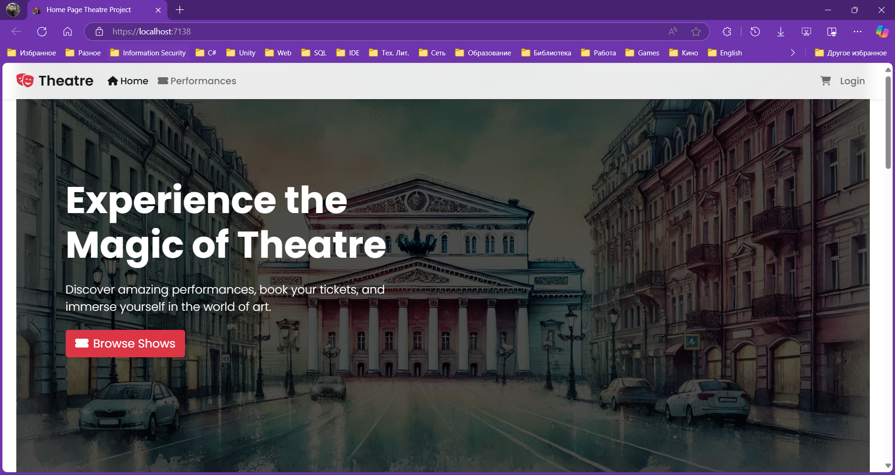
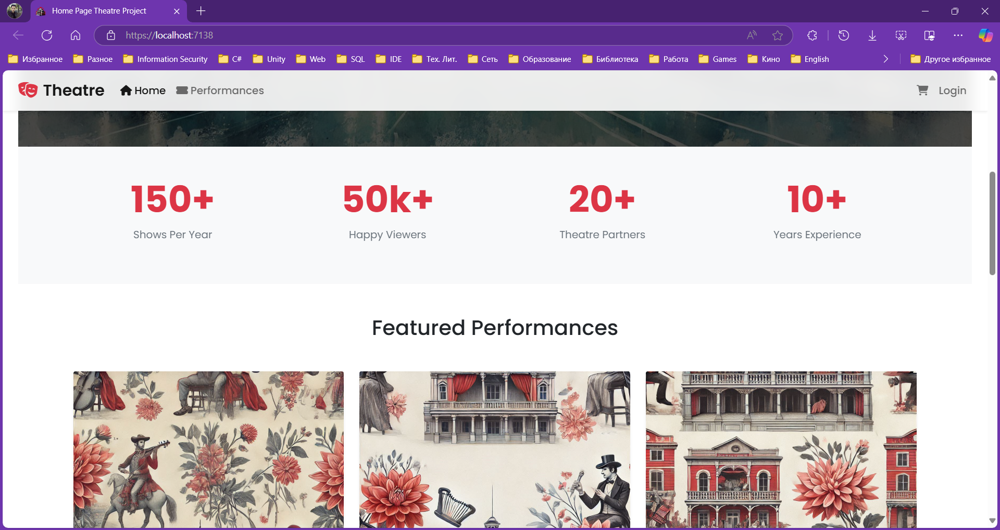
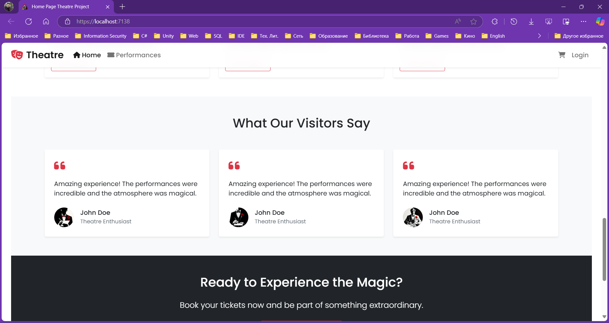

# TheatreProjectMicroservices

A microservices-based theatre booking system that allows users to browse performances, book tickets, and manage their orders.
The project is based on the course ".NET Core Microservices - The Complete Guide" with significant modifications and improvements:
changed theme, completely redesigned UI/UX, added new features specific to theatre domain, implemented comprehensive unit testing, enhanced caching mechanism, improved logging and monitoring, added email notifications and more.

## Architecture

The solution consists of the following microservices:

- **TheatreProject.WebApp**: Frontend MVC application
- **TheatreProject.PerformanceAPI**: Manages theatre performances and seats
- **TheatreProject.OrderAPI**: Handles order processing and payments
- **TheatreProject.ShoppingCartAPI**: Manages user shopping carts
- **TheatreProject.CouponAPI**: Manages coupon codes
- **TheatreProject.EmailAPI**: Manages email notifications
- **TheatreProject.Identity**: Manages user authentication and authorization
- **TheatreProject.MessageBus**: Azure Service Bus for inter-service communication
- **TheatreProject.GatewaySolution**: API Gateway for routing requests to the appropriate microservice

## Technologies

- .NET 8
- ASP.NET Core MVC
- Entity Framework Core
- SQL Server
- Azure Service Bus
- Stripe Payment Integration
- MailKit
- AutoMapper
- JWT Authentication

## Features

- 🎭 Browse theatre performances
- 🎟️ Book tickets with seat selection
- 💳 Secure payment processing
- 📧 Email notifications
- 📊 Orders dashboard

## Author

Bohdan Harabadzhyu

## License

This project is licensed under the terms of the GNU General Public License v3.0 (GPL-3.0) - see the [LICENSE](LICENSE) file for details.
